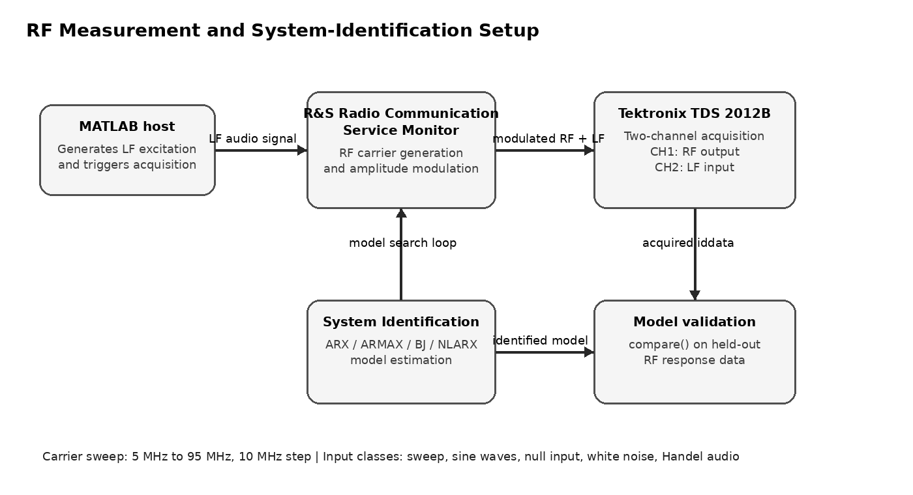
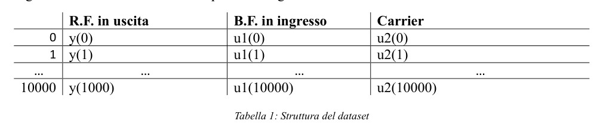
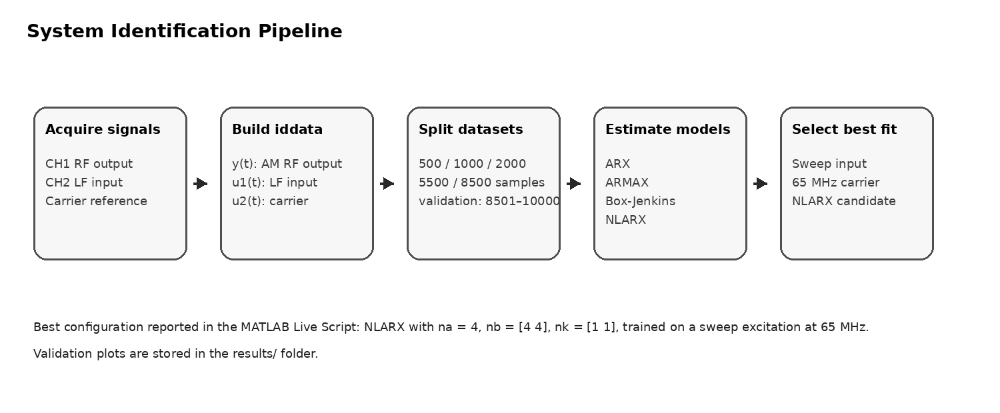
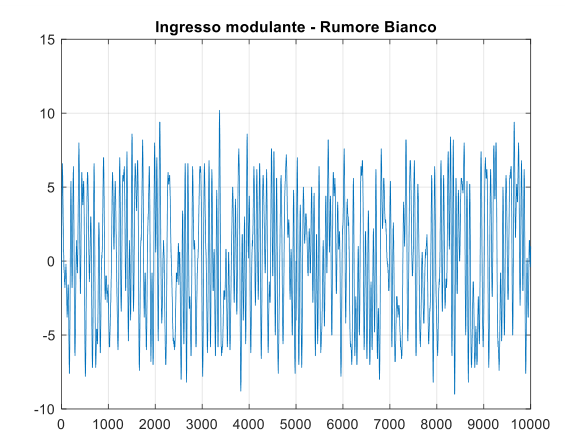
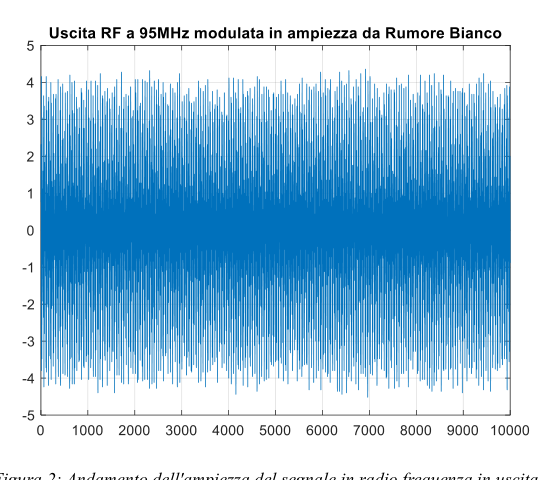
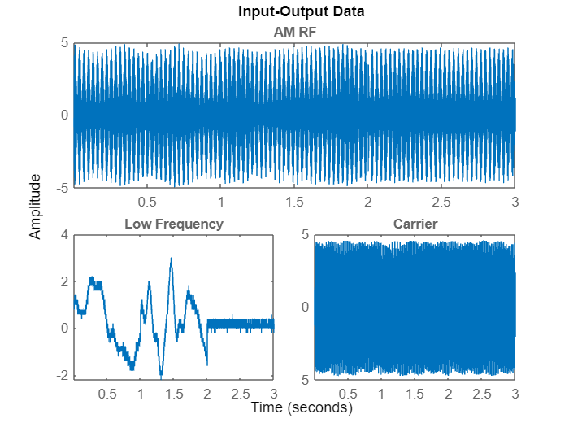
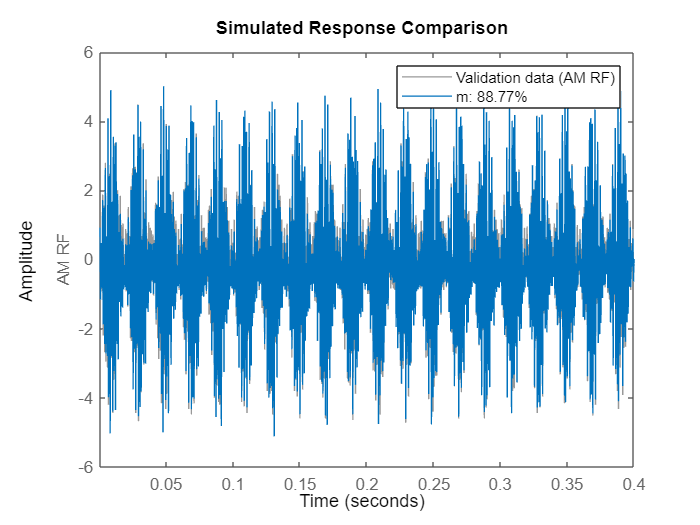

# RF System Identification of a Radio Communication Service Monitor


MATLAB project for identifying the dynamic behavior of an RF transmission system using measured input-output data acquired from a **Rohde & Schwarz Radio Communication Service Monitor** and a **Tektronix TDS 2012B oscilloscope**.

The project builds a dataset of amplitude-modulated RF measurements under different low-frequency excitation signals and carrier-frequency configurations. The measured data are then processed in MATLAB and used to estimate linear and nonlinear system-identification models, including **ARX**, **ARMAX**, **Box-Jenkins** and **NLARX** structures.

<p align="center">
  
</p>

<p align="center">
  <em>Figure 1. Measurement and identification workflow used to acquire RF input-output data and validate MATLAB models.</em>
</p>

---

## 1. Engineering objective

The goal of the project is to identify a model capable of reproducing the measured RF output of a radio transmission system starting from the available input signals.

The system can be represented as a discrete-time input-output mapping:

```math
\hat{y}(k) = f_\theta\big(y(k-1), \ldots, u_1(k-n), u_2(k-n)\big)
```

where:

| Symbol | Meaning |
|---|---|
| `u_1(k)` | low-frequency modulating signal acquired from the oscilloscope |
| `u_2(k)` | RF carrier signal |
| `y(k)` | measured amplitude-modulated RF output |
| `f_θ` | identified linear or nonlinear model |
| `ŷ(k)` | predicted RF output |

The identification task is evaluated by comparing the simulated model response with held-out validation data.

---

## 2. Measurement setup

The acquisition setup is composed of:

| Component | Role |
|---|---|
| Rohde & Schwarz Radio Communication Service Monitor | RF signal generation and amplitude-modulated transmission under test conditions |
| Tektronix TDS 2012B oscilloscope | Two-channel acquisition of the input and output signals |
| MATLAB | Signal generation, oscilloscope communication, data storage and system identification |
| USB connection | Communication between MATLAB and oscilloscope through Instrument Control Toolbox |
| Audio jack connection | Low-frequency signal injection from the PC to the radio system |

The oscilloscope uses two acquisition channels:

| Channel | Measured signal |
|---|---|
| CH1 | RF output signal after modulation |
| CH2 | low-frequency input signal used for modulation |

MATLAB generates the low-frequency excitation and simultaneously starts the oscilloscope acquisition, allowing the input-output pair to be stored as a MATLAB `iddata` object.

---

## 3. Dataset structure

The dataset is composed of three time-domain signals:

| Column | Signal | Description |
|---|---|---|
| `y(t)` | RF output | amplitude-modulated RF signal measured at the radio-system output |
| `u1(t)` | low-frequency input | modulating signal injected into the system |
| `u2(t)` | carrier | RF carrier signal used during transmission |

<p align="center">
  
</p>

<p align="center">
  <em>Figure 2. Dataset structure with RF output, low-frequency input and carrier signal.</em>
</p>

The measurement campaign considers carrier-frequency configurations from **5 MHz to 95 MHz** with a **10 MHz step**. Each acquisition contains approximately **10,000 samples** for each carrier configuration.

The low-frequency input signal classes include:

| Input class | Description |
|---|---|
| Sweep | frequency-varying signal from 20 Hz to 20 kHz |
| Sin800Hz | sinusoidal input at 800 Hz |
| Sin6660Hz | sinusoidal input at 6660 Hz |
| Sin13000Hz | sinusoidal input at 13 kHz |
| Sin20KHz | sinusoidal input at 20 kHz |
| Segnale nullo | null input signal |
| Rumore Bianco | white-noise excitation |
| Handel | audio signal, *Gloria in Excelsis Deo* |

Example input-output measurements are stored in the `results/` folder.

---

## 4. System-identification workflow

<p align="center">
  
</p>

<p align="center">
  <em>Figure 3. MATLAB identification pipeline from data acquisition to model validation.</em>
</p>

The MATLAB workflow performs the following operations:

1. load one measurement folder as a MATLAB `iddata` object;
2. inspect the RF output, low-frequency input and carrier signal;
3. create training and validation splits;
4. optionally detrend the data before model estimation;
5. estimate multiple model families;
6. compare the simulated response against validation data;
7. retain the best-fit configuration.

The validation portion used in the Live Script is typically extracted from the final part of the acquisition:

```matlab
valid = data(8501:10000);
```

---

## 5. Model families

The project evaluates both linear and nonlinear identification models.

| Model family | MATLAB function | Engineering role |
|---|---|---|
| ARX | `arx` | linear autoregressive model with exogenous inputs |
| ARMAX | `armax` | ARX extension with moving-average noise dynamics |
| Box-Jenkins | `bj` | separate process and noise dynamics |
| NLARX | `nlarx` | nonlinear autoregressive model with exogenous inputs |

The tested structures include low-order and higher-order configurations. A representative second configuration uses:

```matlab
na = 4;
nb = 4*ones(1,2);
nk = 1*ones(1,2);
```

For the selected nonlinear model, the Live Script reports the best configuration on the **Sweep / 65 MHz** dataset using:

```matlab
na = 4;
nb = [4 4];
nk = [1 1];
```

---

## 6. Results

### Example measured signals

<p align="center">
  
</p>

<p align="center">
  <em>Figure 4. Example low-frequency white-noise excitation used as modulating input.</em>
</p>

<p align="center">
  
</p>

<p align="center">
  <em>Figure 5. Example RF output at 95 MHz modulated in amplitude by the white-noise input.</em>
</p>

### MATLAB input-output inspection

<p align="center">
  
</p>

<p align="center">
  <em>Figure 6. MATLAB input-output visualization for a Handel excitation at 55 MHz.</em>
</p>

### Model validation

The best search result reported in the MATLAB Live Script is obtained with a nonlinear ARX model on the **Sweep / 65 MHz** dataset. The Live Script reports a best-fit value of approximately **93.6592%** for the selected configuration.

A representative validation response is shown below.

<p align="center">
  
</p>

<p align="center">
  <em>Figure 7. Simulated response comparison for a selected NLARX model.</em>
</p>

The `results/` folder also contains negative-fit comparison plots. These are intentionally retained because they document model configurations that did not generalize well and help explain why the model-selection step is necessary.

---

## 7. Repository structure

```text
rf-system-identification-rs-monitor/
├── assets/
│   ├── measurement_setup_workflow.png
│   ├── identification_pipeline.png
│   └── dataset_table_structure.png
├── docs/
│   └── Dataset_del_sistema_radio_in_trasmissione.pdf
├── results/
│   ├── low_frequency_white_noise_input.png
│   ├── rf_output_white_noise_95mhz.png
│   ├── input_output_data_55mhz_handel.png
│   ├── nlarx_validation_response_8877.png
│   ├── nlarx_validation_negative_fit_raw.png
│   ├── nlarx_validation_after_detrend_negative_fit.png
│   ├── dataset_summary.csv
│   ├── identification_summary.csv
│   └── results_summary.md
├── src/
│   └── matlab/
│       └── SystemIdentification_0.mlx
├── README.md
└── .gitignore
```

---

## 8. Dataset policy

Raw RF measurement datasets are not tracked in this repository.

The original measurement folders contain `.mat` files such as:

```text
data_iddataC.mat
```

These files are excluded because they are hardware-specific and can become large. The repository keeps the MATLAB Live Script, documentation and lightweight result artifacts needed to describe and reproduce the methodology.

To reproduce the complete workflow locally, place the measurement folders in the expected MATLAB working directory, for example:

```text
data/
├── Rumore Bianco/
├── Segnale Sweep/
├── Segnale nullo/
├── Sin800Hz/
├── Sin6660Hz/
├── Sin13000Hz/
├── Sin20KHz/
└── Handel/
```

Each signal folder should contain carrier-frequency subfolders with the corresponding `data_iddataC.mat` file.

---

## 9. Requirements

The project was developed in MATLAB.

Expected MATLAB components:

- MATLAB;
- Instrument Control Toolbox, for oscilloscope communication;
- System Identification Toolbox, for `iddata`, `arx`, `armax`, `bj`, `nlarx` and `compare`;
- Signal Processing Toolbox, for signal preprocessing and analysis utilities.

---

## 10. How to run

Open MATLAB and run the Live Script:

```matlab
open src/matlab/SystemIdentification_0.mlx
```

or execute the corresponding script cells interactively.

A typical loading pattern is:

```matlab
directory = "Segnale Sweep";
subdirectory = "65MHz";
load(sprintf("%s/%s/data_iddataC.mat", directory, subdirectory));
plot(data);
```

Then estimate and validate a model:

```matlab
data1000 = data(1:1000);
valid = data(8501:10000);

na = 4;
nb = [4 4];
nk = [1 1];

model = nlarx(data1000, [na nb nk]);
compare(model, valid);
```

---

## 11. Documentation

The dataset and measurement procedure are described in:

```text
docs/Dataset_del_sistema_radio_in_trasmissione.pdf
```

The MATLAB identification workflow is contained in:

```text
src/matlab/SystemIdentification_0.mlx
```

---

## 12. Future work

Possible extensions include:

- adding automatic scripts to reproduce all model-family comparisons;
- exporting fit metrics for every signal class and carrier frequency;
- testing nonlinear neural state-space or Hammerstein-Wiener models;
- evaluating cross-frequency generalization of the identified models;
- adding a reproducible public subset of the RF measurement dataset;
- automating report generation from MATLAB result tables.

---

## Author

Michele Abbaticchio  
MSc Automation Engineering  
Politecnico di Bari
